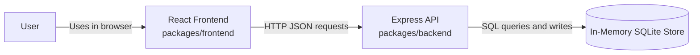
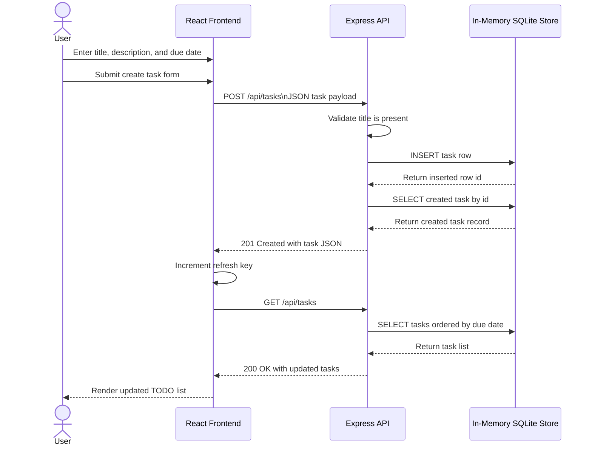

# Cloud Architecture Overview

This document provides a simple architecture view of the TODO monorepo and shows the runtime interaction for creating a task.

## System Context

## Sequence: Create a TODO

